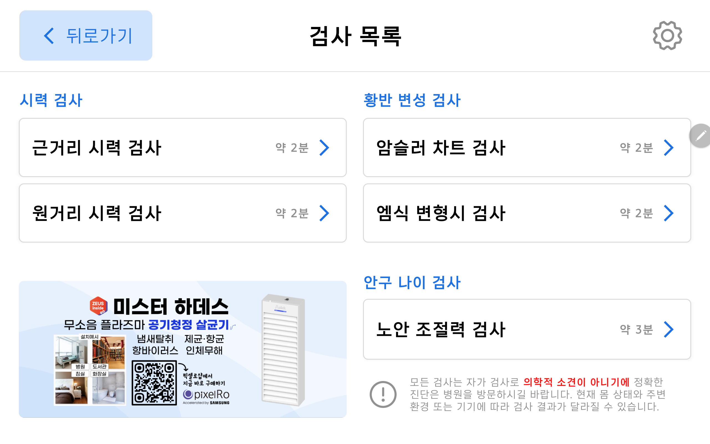
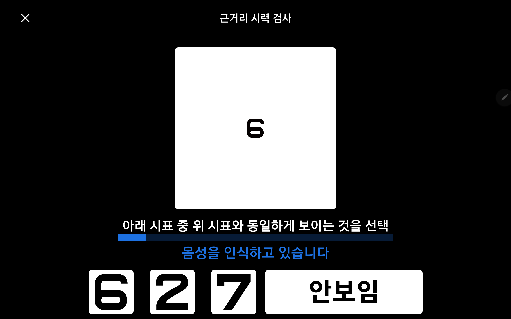
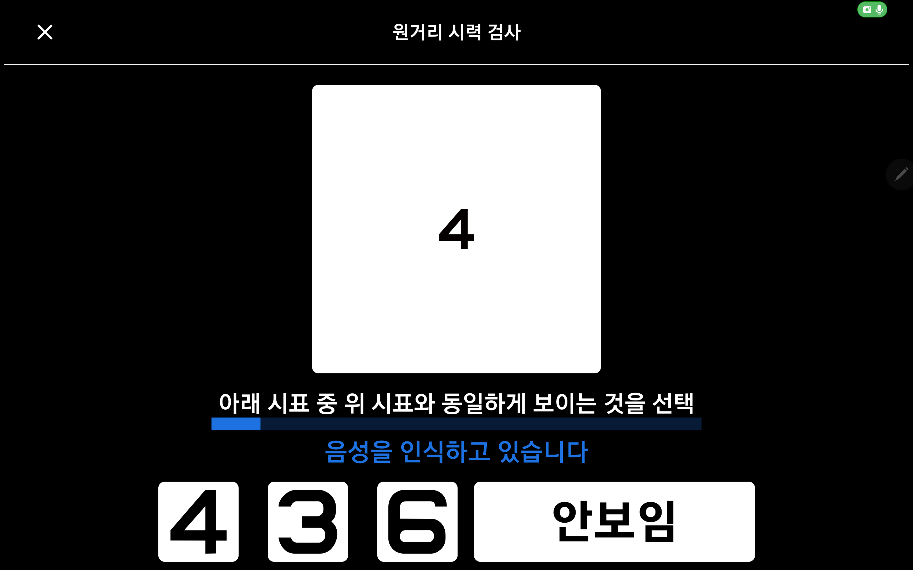
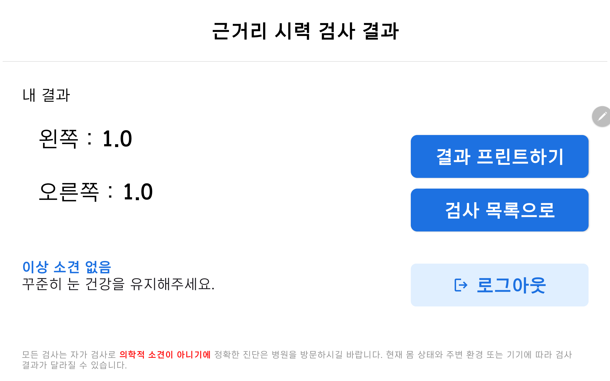
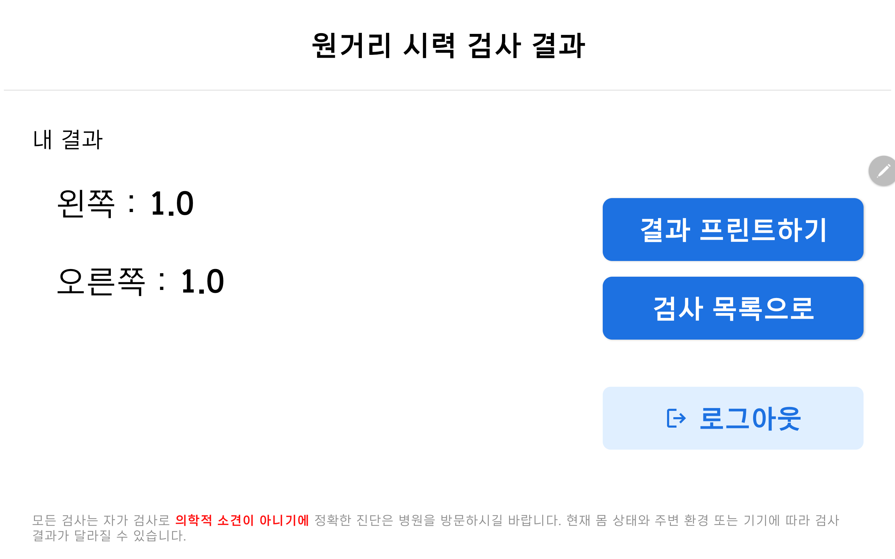
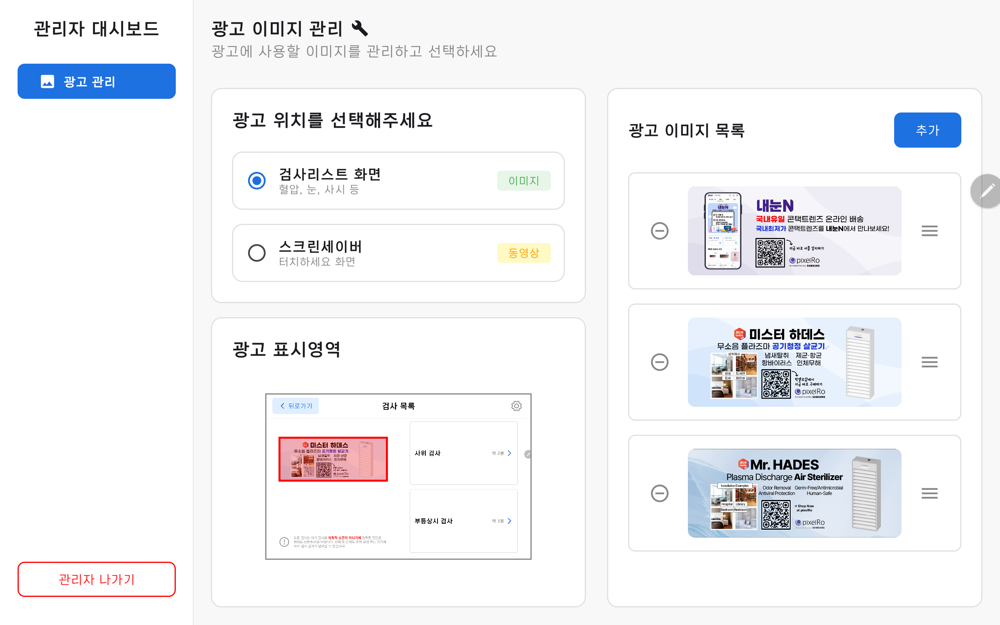
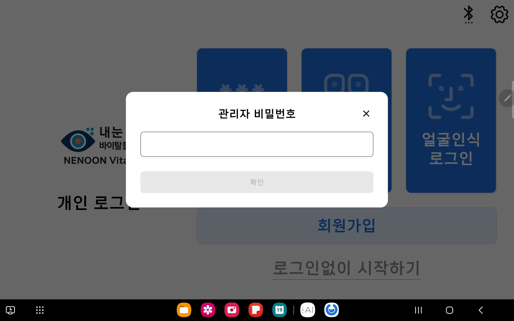

# Nenoon Kiosk+ (내눈 키오스크+)

## 목차

- [프로젝트 개요](#프로젝트-개요)
- [핵심 기능](#핵심-기능)
- [기술 스택](#기술-스택)
- [시스템 아키텍처](#시스템-아키텍처)
- [설치 및 실행](#설치-및-실행)
- [팀원 소개](#팀원-소개)

---

## 프로젝트 개요

내눈 키오스크+는 안과 검진 및 바이탈 측정을 통합한 키오스크 솔루션입니다.
사용자가 직접 시력, 황반변성, 사시, 노안조절력 등 다양한 안과 검사를 수행하고,
혈압, 악력, 치매 검사 등 바이탈 측정까지 가능한 통합 검진 키오스크입니다.

### 기획 의도

실버계층의 건강 관리 접근성 향상을 목표로 합니다.

- 병원 방문 없이 간편한 자가 검진
- 다양한 안과 검사 및 바이탈 측정 통합
- 직관적인 UI/UX로 누구나 쉽게 사용 가능
- 검사 결과 즉시 확인 및 프린터 출력

### 서비스 정보

| 항목 | 내용 |
|------|------|
| 개발 기간 | 2025.10 ~ 2025.11 |
| 팀원 | 6명 |
| 주요 특징 | 얼굴 인식 로그인, 음성 안내(TTS), 프린터 연동, 다국어 지원 |

---

## 핵심 기능

### 시력 검사

| 화면 | 설명 |
|------|------|
|  | 시력 검사 선택 화면 |
|  | 근거리 시력 검사 |
|  | 원거리 시력 검사 |
|  | 근거리 검사 결과 |
|  | 원거리 검사 결과 |

### 관리자 대시보드

| 화면 | 설명 |
|------|------|
|  | 관리자 대시보드 |
|  | 관리자 대시보드 진입 |

---

## 기술 스택

| 분류 | 기술 |
|------|------|
| Language | Kotlin 2.1.12, Java 17 |
| UI | Jetpack Compose, Material 3 |
| Architecture | MVI (Orbit), Clean Architecture |
| AI | ML Kit (얼굴 인식, 시선 감지), TFLite |
| 음성 | Android TTS |

---

## 시스템 아키텍처

```
┌─────────────────────────────────────────────────────────┐
│                    Presentation Layer                   │
│       (Compose UI, ViewModel, Orbit MVI, Navigation)    │
└─────────────────────────────────────────────────────────┘
                            │
┌─────────────────────────────────────────────────────────┐
│                      Domain Layer                       │
│                (Business Logic, Contracts)               │
└─────────────────────────────────────────────────────────┘
                            │
┌─────────────────────────────────────────────────────────┐
│                       Data Layer                        │
│        (Repository, DataSource, API, Local Storage)     │
└─────────────────────────────────────────────────────────┘
                            │
┌─────────────────────────────────────────────────────────┐
│                    External Services                    │
│       (Camera, ML Kit, Bluetooth, Printer, TTS)         │
└─────────────────────────────────────────────────────────┘
```

---

## 설치 및 실행

### 사전 요구사항

- Android Studio
- JDK 17 이상
- Android SDK 26 이상
- Gradle 8.0 이상

### SDK 설치

빌드 전 외부 SDK 파일을 `app/libs/` 폴더에 넣어야 합니다.

| 파일 | 용도 |
|------|------|
| `NemonicSdk.aar` | 신형 프린터 |
| `nemonic.aar` | 구형 프린터 (선택사항) |
| `BPBIO_SDK.jar` | 혈압계 연동 |
| `gson-2.7.jar` | JSON 파싱 |

> 다운로드: https://drive.google.com/drive/folders/1cxR8F50x2aE3WhCYqViJyxyL838-3JIq?usp=sharing

### 빌드 및 실행

```bash
git clone [repository-url]
cd Nenoon-Kiosk-dev-2
./gradlew build
./gradlew installDebug
```

> SDK 파일이 없으면 빌드 오류가 발생합니다. 프린터 SDK를 모두 넣으면 구형/신형 프린터 모두 지원됩니다.

---

## 팀원 소개

| 이름 | 역할 |
|------|------|
| 김수현 | Android, Design |
| 박성준 | Android |
| 박주현 | Backend |
| 오인성 | Android |
| 천지윤 | Android, Design |
| 편민우 | Android, AI |
